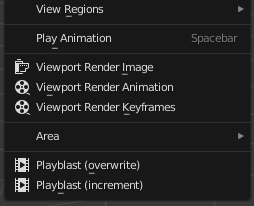

# DuBlast

*DuBlast* is an add-on for *Blender* which makes it easy to create and play animation playblasts, without having to change any render or output setting.

[You can download it here](https://rainboxlab.org/tools/dublast/).

## Usage

It adds an *Animation Playblast* entry in the *View 3D > View* menu.

It renders the animation with the current viewport settings, temporarily overriding the output settings. By default, it will render the animation with a resolution of 25% of the output dimensions, in the default temp folder for your system. It then automatically opens and plays the animation.

By default, the rendered animation is stored in an *MP4* file, with custom settings tweaked for better animation playback and seekability (it is easy to go frame by frame in these files).

You can [adjust these and other settings](settings.md) for playblast creation in the *Output Settings* Tab of the *Properties* panel.

!!! tip
    You can [Right Click] on the menu item and choose *Change Shortcut* to assign it a handy keyboard shortcut.

## Difference between *DuBlast* and the native *Viewport Render Animation* command

|DuBlast|Viewport Render Animation|
|---------|---------------------------|
|**Automatically plays** the rendered animation|Needs the user to **manually play** the animation [Ctrl] + [F11]|
|**Has its own output settings**, so the user can create playblasts without altering the output settings of the scene|**Shares the output settings** with the scene/render settings, which means the user has to alter the output settings even if they're already set for rendering the scene|
|Has **custom output format presets** for better animation playback and seek|Needs the user to **manually set the output** to an animator friendly format|
|**Scales down the size of the text for the metadata** according to the resolution %|**Keeps the same size for the text of the metadata**, no matter the output resolution, which results in huge texts at lower resolution|
|Atomatically adjusts the rendered animation dimension to **fit the *MP4* requirements** when set to use *MP4*|The user has to **find a fitting resolution %** for the dimensions to have an even number of lines and columns|

## License

### Software

***DuBlast* Copyright (c) 2020 Nicolas Dufresne**  

*DuBlast* is free software; you can redistribute it and/or modify it under the terms of the GNU General Public License as published by the Free Software Foundation; either version 3 of the License, or (at your option) any later version.

*DuBlast* is distributed in the hope that it will be useful, but WITHOUT ANY WARRANTY; without even the implied warranty of MERCHANTABILITY or FITNESS FOR A PARTICULAR PURPOSE.  See the GNU General Public License for more details.

A copy of the *GNU General Public License* is included in the section entitled "[GNU GPLv3](gnu-gpl.md)".

 

### Documentation

**Copyright (C)  2020 Nicolas Dufresne**  
Permission is granted to copy, distribute and/or modify this document under the terms of the GNU Free Documentation License, Version 1.3 or any later version published by the Free Software Foundation;  
with no Invariant Sections, no Front-Cover Texts, and no Back-Cover Texts.

A copy of the license is included in the section entitled "[Documentation License](doc-license.md)".

 
